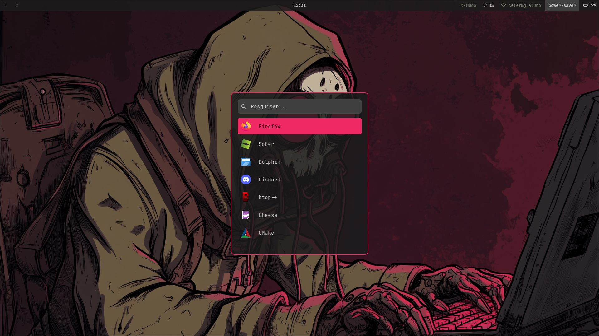
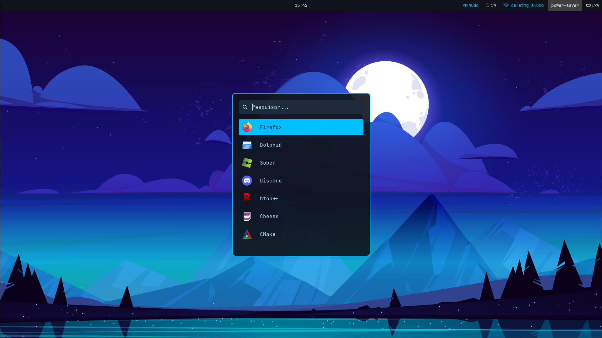
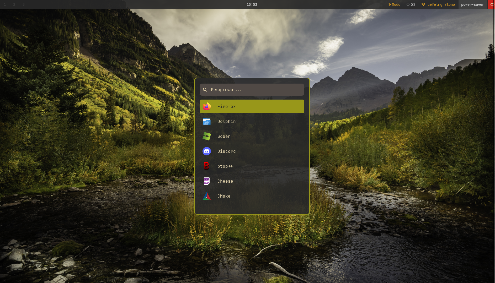
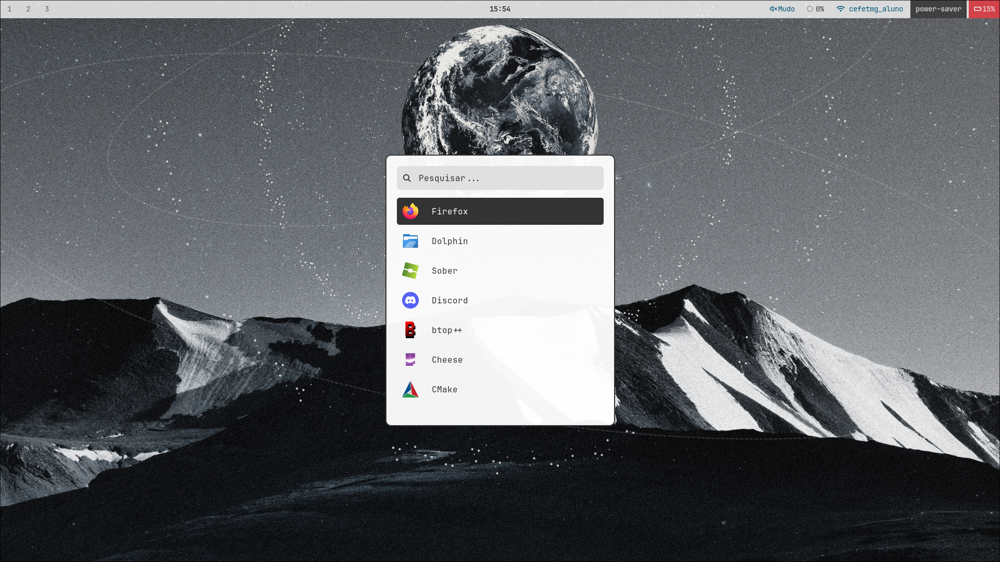

# Arch Linux Hyprland Dotfiles

This repository contains my personal configurations, automation scripts, and package list for Arch Linux.

## 💻 Reference Hardware

* **Model:** Acer Aspire 5 A515-45
* **CPU:** AMD Ryzen (5000U Series)
* **GPU:** AMD Radeon Graphics (Integrated)
* **RAM:** 12GB
* **OS:** Arch Linux

## 🛠️ Software Stack

| Category          | Program    |
| :---------------- | :--------- |
| **Window Manager**| Hyprland   |
| **Bar** | Waybar     |
| **Launcher** | Rofi       |
| **Terminal** | Kitty      |
| **Notifications** | Mako       |
| **File Manager** | Dolphin    |
| **Browser** | Firefox |

## 📸 Previews

Here's a look at some of my setups. Each screenshot features a specific wallpaper and a theme designed to complement it.

### Dark Red Theme


### Dark Blue Theme


### Nature Green Theme


### Abstract Light Theme


## 📂 File Structure

* `config/`: User configuration files (`~/.config/`).
* `system/`: System-wide configurations (`/etc/`, kernel optimizations, modprobe).
* `scripts/`: Personal utility scripts.
* `packages/`: Lists of installed packages (pacman/yay).
* `wallpapers/`: Collection of desktop backgrounds.
* `.screenshots/`: Screenshots of my setup.

## 🚀 Installation / Restoration

1.  **Clone the repository:**
    ```bash
    git clone https://github.com/wescleyj/dotfiles-arch-hyprland.git ~/dotfiles
    ```

2.  **Install packages:**
    ```bash
    yay -S --needed - < packages/pkglist.txt
    ```

3.  **Link configurations (Stow or Manual):**
    ```bash
    # Manual example
    cp -r ~/dotfiles/config/* ~/.config/
    ```

## ⚡ Applied Optimizations

* **ZRAM:** Configuration via `zram-generator`.
* **AMD:** `vulkan-radeon` drivers and `amd-ucode`.
* **Kernel:** Specific parameters for battery saving/performance on Acer Aspire.
